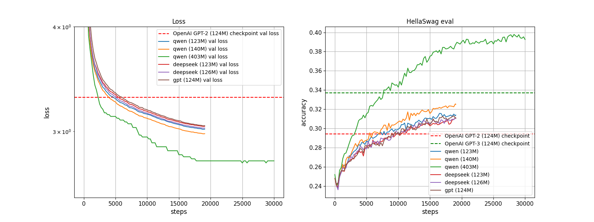

# MiniOpenLLM: GPT-2, DeepSeek-V3...
Simple implementation of some open source LLMs, including:
- **GPT-2**
- **Qwen-2/2.5**
- **DeepSeek-V3** (only the structure, i.e., MLA and MoE. MTP or other training tricks are not implemented.)
- developing...

<p style="text-align: center;">
    
    <br>
    <em>Pretrain</em>
</p>

<p style="text-align: center;">
    
    <br>
    <em>GRPO (Qwen2.5-0.5B-Instruct)</em>
</p>

> Star it if you find this repo useful!

# Requirements
Install the required packages with the following command:
```bash
conda create -n miniopenllm python=3.10
pip install -r requirements.txt
```

# Datasets

## Pretrain: FineWeb-edu-10B
Run `python fineweb.py` to obtain `FineWeb-edu-10B` dataset.

> Run `HF_ENDPOINT=https://hf-mirror.com python fineweb.py` if can't visit `huggingface.co`.

## Eval: Hellaswag
Run `python hellaswag.py` to obtain `hellaswag` dataset, which serves as a benchmark for evaluating the model's capability more intuitively using accuracy (from random selection, 25\% acc, to being able to make some correct choices).

## GRPO: GSM8K

From [openai/gsm8k](https://huggingface.co/datasets/openai/gsm8k), which contains 8.5K high quality linguistically diverse grade school math word problems.

# Exp

## Pretrain

```bash
bash scripts/run.sh
```
to train the specific model.

> Reduce `batch_size` if OOM.

```bash
python visual.py
```

to get the visualization of training dynamics.

## Postrain

### SFT

TODO

### GRPO

Currently using the implementation in trl:

```bash
bash scripts/run_grpo.sh
```

# Reference

I sincerely thank the following outstanding works that provide valuable datasets and code base:

## Dataset
- [Hugginface: FineWeb-edu](https://huggingface.co/datasets/HuggingFaceFW/fineweb-edu)
- [Paper: FineWeb](https://arxiv.org/abs/2406.17557)
- [Github repo: Hellaswag](https://github.com/rowanz/hellaswag)
- [Paper: Hellaswag](https://arxiv.org/abs/1905.07830)

## GPT2
- [YouTube video: Let's reproduce GPT-2 (124M) by 
Andrej Karpathy](https://youtu.be/l8pRSuU81PU?si=pxV-eImnqCi2ID1O)
- [Github repo: build-nanogpt](https://github.com/karpathy/build-nanogpt)
- [Github repo: minigpt](https://github.com/victorbjorsvik/minigpt)

> I strongly recommend watching **"Let's reproduce GPT-2 (124M)"**, which provides a step-by-step guide to implementing GPT-2 from scratch, covering key concepts such as the Transformer architecture, training procedures, and optimization techniques, and which serves as the foundation for this repository.

## DeepSeek-V3

- [Github repo: DeepSeek-V3](https://github.com/deepseek-ai/DeepSeek-V3)
- [Paper: DeepSeekMoE](https://arxiv.org/abs/2401.06066)

## GRPO
- [Github Gist: GRPO](https://gist.github.com/willccbb/4676755236bb08cab5f4e54a0475d6fb)

# More Interesting Projects

## Building your own `pytorch`! 
See [micrograd](base/micrograd.py), which is based on [YouTube video: The spelled-out intro to neural networks and backpropagation: building micrograd by 
Andrej Karpathy](https://youtu.be/VMj-3S1tku0?si=eq1qSuO5U2V9VJUi) and [Github repo: micrograd](https://github.com/karpathy/micrograd).
